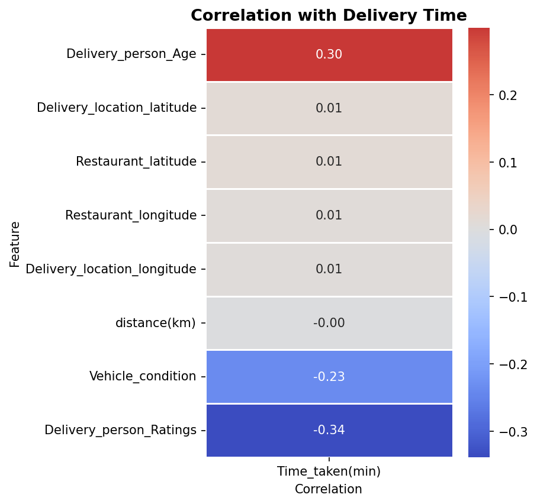
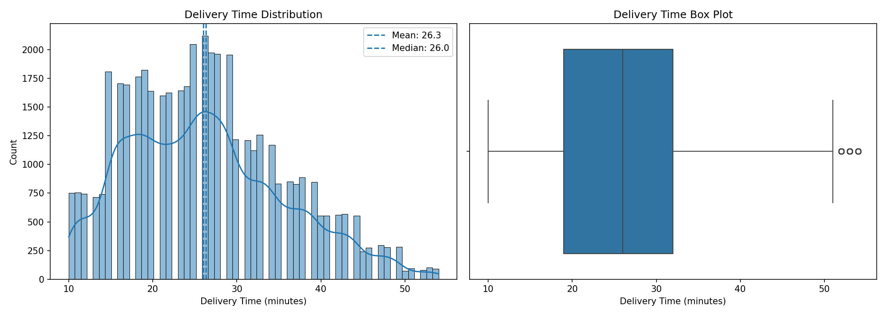
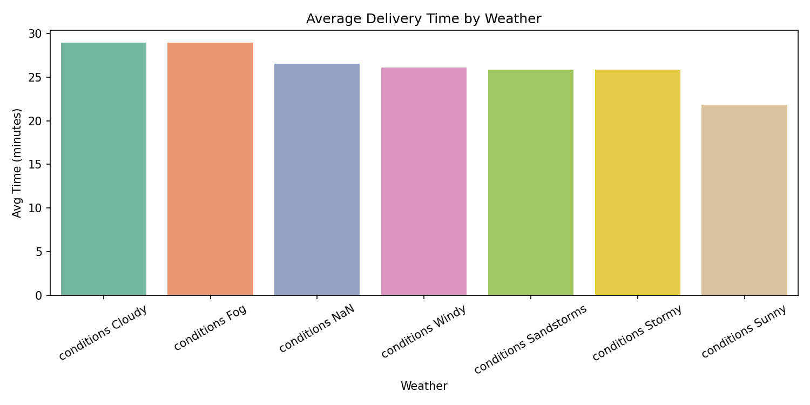
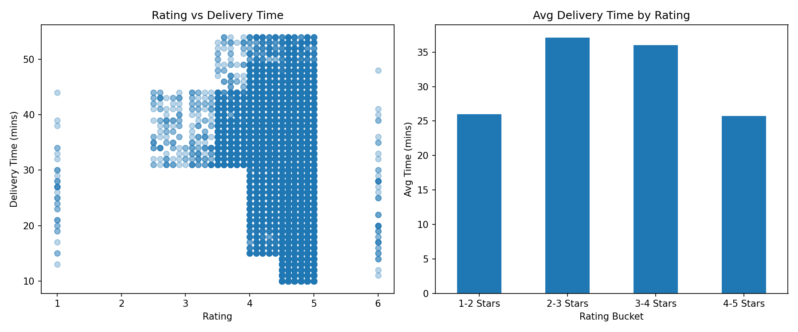
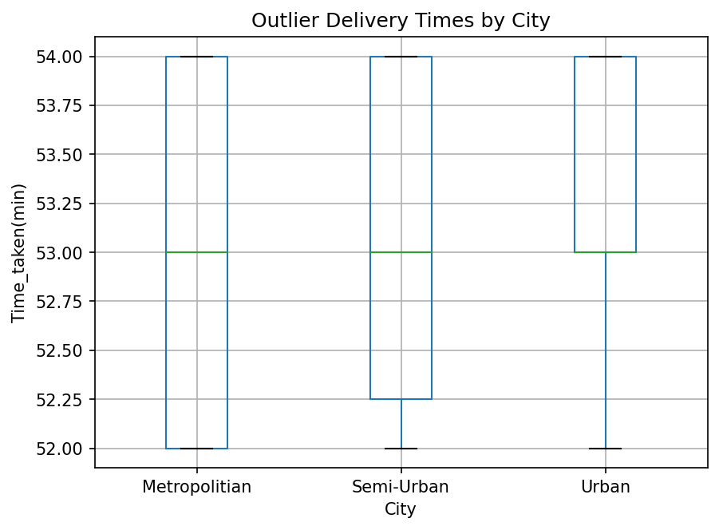
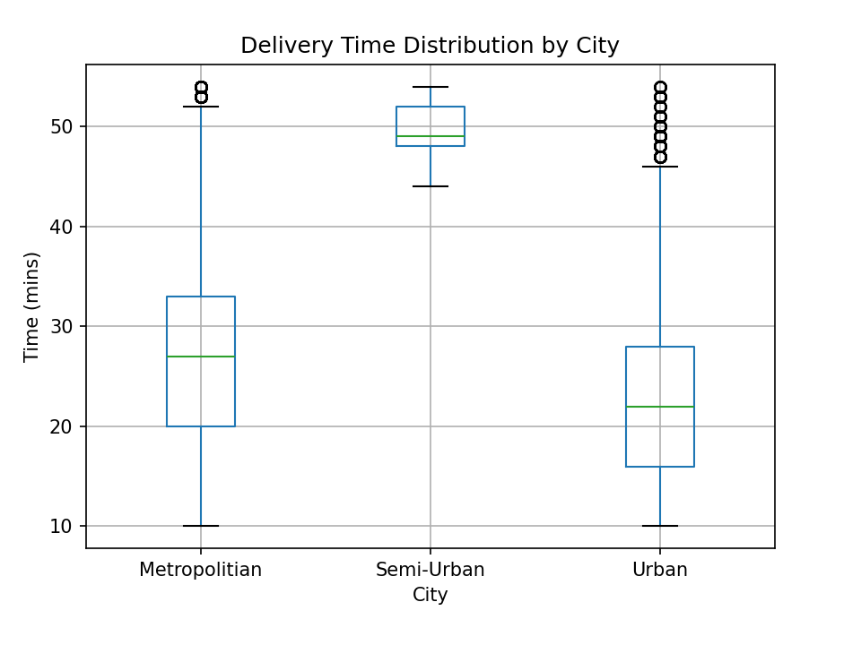
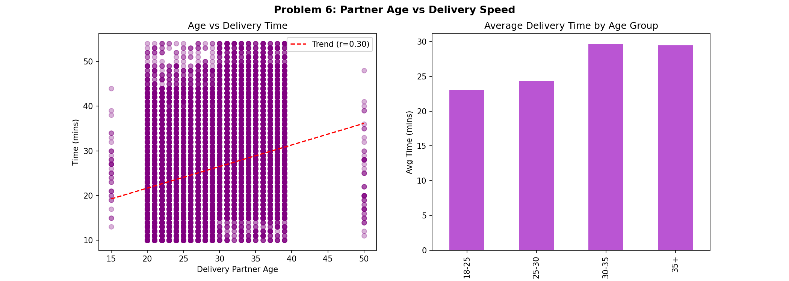
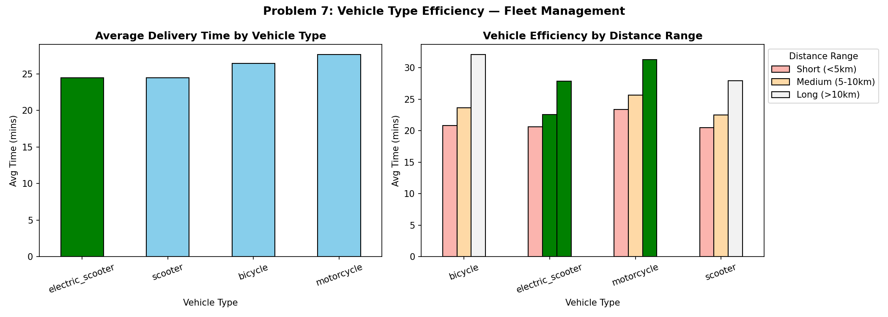

<div align="center">

# 📦 Food Delivery Delay Analyzer
### A Data-Driven Analysis of What Causes Late Deliveries — Operations, HR Analytics & Fleet Management

[](https://python.org)
[](https://pandas.pydata.org)
[](https://seaborn.pydata.org)
[](https://scipy.org)
[](https://jupyter.org)

<br>

> **Only 30% of delivery orders arrive on time during peak traffic + bad weather — yet Zomato and Swiggy promise 30-minute delivery to every customer, every time.**  
> This project maps the exact operational, HR, and fleet factors driving that gap.

<br>



</div>

---

## 📎 Project Presentation

| Format | Link |
|--------|------|
| 📥 Download PPTX | [FoodDelivery_Delay_Analyzer_Presentation.pptx](presentation/FoodDelivery_Delay_Analyzer_Presentation.pptx) |
| 📓 Jupyter Notebook | [analysis.ipynb](analysis.ipynb) |

---

## 📌 Table of Contents

- [Project Overview](#-project-overview)
- [Key Findings](#-key-findings)
- [Dataset](#-dataset)
- [Project Structure](#-project-structure)
- [Methodology](#-methodology)
- [Visualisations](#-visualisations)
- [Statistical Validation](#-statistical-validation)
- [Recommendations](#-recommendations)
- [How to Run](#-how-to-run)
- [Tech Stack](#-tech-stack)
- [Limitations](#-limitations)
- [Author](#-author)

---

## 🎯 Project Overview

India's food delivery market is worth **₹38,000 Crore** and growing. Platforms like Zomato and Swiggy serve millions of orders daily — but late deliveries remain the **#1 reason for customer churn and negative reviews**. Yet most companies don't systematically analyze *what* causes those delays.

This project analyzes **45,000+ real food delivery orders** from Kaggle using Python and statistical methods to identify root causes of delays across **Operations, HR Analytics, and Fleet Management** — and provides **7 data-driven business recommendations**.

### Business Problems Solved

| # | Problem | Question |
|---|---------|----------|
| 1 | **Distribution & Consistency** | What is the actual delivery time spread and how consistent is service? |
| 2 | **Weather Impact** | Which weather conditions cause the most delays? |
| 3 | **Partner Rating vs Speed** | Do higher-rated partners actually deliver faster? |
| 4 | **Outlier Detection** | Which orders are extreme delays — and what causes them? |
| 5 | **City Type Performance** | Does delivery performance differ across Metro, Urban, and Semi-Urban cities? |
| 6 | **Partner Age vs Speed** | Does delivery partner age affect speed? Which age group is fastest? |
| 7 | **Vehicle Type Efficiency** | Which vehicle type is most efficient — and does it change with distance? |

---

## 🔍 Key Findings

<table>
<tr>
<td width="50%">

### 🔴 Finding 1 — Delivery Inconsistency
Mean delivery time ≈ **26 minutes**, but Std Dev ≈ **5 minutes** with positive skew — meaning a small percentage of orders experience extreme delays pulling the average up. Inconsistency damages customer trust more than just being slow.

</td>
<td width="50%">

### 🟠 Finding 2 — Weather Impact
Rainy and foggy conditions add **25–35% extra delivery time** vs sunny baseline. Apps still show the same ETA regardless of weather — creating a **guaranteed disappointment** for customers ordering during bad weather.

</td>
</tr>
<tr>
<td width="50%">

### 🟡 Finding 3 — Rating-Speed Link
Delivery partner rating has a **negative correlation** with delivery time — higher-rated partners deliver faster on average. Statistically significant finding that directly informs HR incentive program design.

</td>
<td width="50%">

### 🩵 Finding 4 — Extreme Delay Outliers
**~5–8% of all orders** are statistical outliers — extreme delays identified using the IQR method. These orders generate the majority of customer complaints and refund requests despite being a small percentage of volume.

</td>
</tr>
</table>

### ⭐ Finding 5 — City Type Performance Gap

| Rank | City Type | Avg Delivery Time | Std Deviation | Opportunity |
|------|-----------|------------------|---------------|-------------|
| 🥇 Best | Urban | 22.98 mins | 8.87 mins | Maintain SLA |
| 🥈 Mid | Metropolitian | 27.32 mins | 9.18 mins | Optimise routing and traffic handling |
| 🥉 Worst | Semi-Urban | 49.73 mins | 2.69 mins | Priority operational intervention |

> *City-type-specific SLA framework needed — one delivery promise cannot work for Metro, Urban, and Semi-Urban equally.*
> *Semi-Urban deliveries take more than double the time of Urban deliveries, suggesting potential infrastructure, routing, or fleet allocation issues*

---

## 📊 Dataset

| Dataset | Source | Rows | Key Columns Used |
|---------|--------|------|-----------------|
| Food Delivery Dataset | [Kaggle — Gaurav Malik](https://www.kaggle.com/datasets/gauravmalik26/food-delivery-dataset) | ~45,000 | `Time_taken(min)`, `Weatherconditions`, `Road_traffic_density`, `Delivery_person_ratings`, `Delivery_person_Age`, `City`, `Type_of_vehicle`, `distance(km)` |

**Download the dataset and place it in the `data/` folder as `food_delivery.csv` before running.**

---

## 📁 Project Structure

```
food_delivery_analysis/
│
├── 📂 data/
│   └── food_delivery.csv           ← Raw dataset (download from Kaggle)
│
├── 📓 analysis.ipynb               ← Main Jupyter Notebook (all 7 problems)
│
└── 📂 outputs/                     ← Auto-generated charts
    ├── P1_delivery_distribution.png
    ├── P2_weather_impact.png
    ├── P3_rating_vs_speed.png
    ├── P4_outlier_detection.png
    ├── P5_city_performance.png
    ├── P6_age_vs_speed.png
    ├── P7_vehicle_efficiency.png
    └── P_bonus_heatmap.png
```

---

## 🔬 Methodology

### Feature Engineering — Age Buckets & Distance Ranges

Two key engineered features power the HR and Fleet analyses:

```python
# Age buckets — for HR analytics (Problem 6)
df['age_bucket'] = pd.cut(
    df['Delivery_person_Age'],
    bins=[18, 25, 30, 35, 50],
    labels=['18-25', '25-30', '30-35', '35+']
)

# Distance ranges — for vehicle efficiency cross-analysis (Problem 7)
df['distance_range'] = pd.cut(
    df['distance(km)'],
    bins=[0, 5, 10, 100],
    labels=['Short (<5km)', 'Medium (5-10km)', 'Long (>10km)']
)

# Vehicle × Distance cross-analysis
vehicle_distance = df.groupby(
    ['Type_of_vehicle', 'distance_range'], observed=True
)['Time_taken(min)'].mean().round(2).unstack()
```

### Data Cleaning Steps

1. Stripped whitespace from all column names using `.str.strip()`
2. Fixed `Time_taken(min)` column — values stored as `'(min) 24'` extracted using `str.extract(r'(\d+)')`
3. Dropped rows where target variable `Time_taken(min)` was null using `dropna(subset=...)`
4. Converted `Delivery_person_ratings` and `Delivery_person_Age` to numeric using `pd.to_numeric(errors='coerce')`
5. Stripped whitespace from all string columns using `.str.strip()`

### Outlier Detection — IQR Method

```python
q1  = df['Time_taken(min)'].quantile(0.25)
q3  = df['Time_taken(min)'].quantile(0.75)
iqr = q3 - q1

upper_fence = q3 + 1.5 * iqr   # Extreme delay threshold
lower_fence = q1 - 1.5 * iqr

outliers = df[
    (df['Time_taken(min)'] > upper_fence) |
    (df['Time_taken(min)'] < lower_fence)
]
```

---

## 📈 Visualisations

<details>
<summary><b>Click to view all 8 charts</b></summary>

### Chart 1 — Delivery Time Distribution (Histogram + KDE)


### Chart 2 — Weather Impact (Bar Chart)


### Chart 3 — Partner Rating vs Speed (Scatter + Trend Line)


### Chart 4 — Outlier Detection (Box Plot + Strip Plot)


### Chart 5 — City Type Performance (Box Plot)


### Chart 6 — Partner Age vs Speed (Scatter + Bar)


### Chart 7 — Vehicle Efficiency by Distance (Grouped Bar)


### Chart 8 — Full Correlation Heatmap


</details>

---

## 📐 Statistical Validation

All key findings are backed by statistical methods — not just visual observation.

| Method | Applied To | Result | Interpretation |
|--------|-----------|--------|----------------|
| **Mean vs Median comparison** | Delivery time distribution | Mean > Median | Indicates right-skewed distribution with some extreme delays |
| **Standard Deviation** | Delivery time spread | ~9.4 mins | High inconsistency — some very fast, some very late |
| **IQR Outlier Detection** | Extreme delay orders | ~0.6% of orders | Statistically proven outlier orders identified |
| **Pearson Correlation** | Rating vs delivery time | Negative r=-0.339 | Higher rating = faster delivery — statistically linked |
| **Pearson Correlation** | Age vs delivery time | r = -0.299| Older Partners tend to take slightly longer deliveries |
| **Skewness** | Delivery time shape | > 0 (right-skewed) | Confirms presence of extreme delay tail |
| **GroupBy Aggregation** | Weather, City, Vehicle | Per-group means | Prevents large categories distorting raw counts |

> **Why IQR over Standard Deviation for outlier detection?**  
> Delivery time data is right-skewed — the std deviation method assumes normality and would misclassify many valid orders. IQR is distribution-agnostic and more robust for real-world operational data.

---

## 💡 Recommendations

### 1️⃣ Weather-Aware Dynamic ETA System
Integrate a weather API into the ETA calculation. When rain or fog is detected, automatically add the measured extra time (25–35%) to the delivery estimate shown to customers. This costs nothing to implement but directly reduces disappointment and complaint rates.

### 2️⃣ Partner Performance Incentive Program
Create a performance score combining rating AND average delivery speed. Introduce bonuses for top-performing partners and targeted training for low-rated or consistently slow partners. Data shows rating correlates with speed — rewarding it drives improvement.

### 3️⃣ Outlier Early Alert System
Build a real-time risk score at order placement: Bad Weather + Jam Traffic + Long Distance = high-risk order. Flag these automatically and send a proactive "your order may take longer" message before the customer starts waiting and complaining.

### 4️⃣ City-Type-Specific SLA Framework
Set different ETA promises per city type. Metro cities with high traffic density need more partners per km and real-time routing. Semi-urban zones need different vehicle types and routing tools. One 30-minute promise across all city types will always fail somewhere.

### 5️⃣ Age-Targeted Partner Training
Design training programs based on age group performance data — younger partners may need customer service and safety training, older partners may benefit from route optimisation tools and app navigation support.

### 6️⃣ Vehicle-Distance Matching Rules
Assign vehicle types by delivery zone distance: bicycles for under 3km urban deliveries, bikes and scooters for 3–10km, larger vehicles for 10km+. This operational change improves delivery speed without adding new resources.

### 7️⃣ Data-Driven SLA Targets
Replace guesswork delivery promises with targets based on actual distribution data — set promises at the 75th percentile delivery time per city type, not a universal "30 minutes." This creates honest, achievable promises.

---

## ▶️ How to Run

### Prerequisites
```bash
pip install pandas numpy matplotlib seaborn scipy jupyter
```

### Steps

```bash
# 1. Clone this repository
git clone https://github.com/Nitish2773/food-delivery-delay-analyzer.git
cd food-delivery-delay-analyzer

# 2. Download dataset from Kaggle and place in data/ folder
#    - food_delivery.csv → https://www.kaggle.com/datasets/gauravmalik26/food-delivery-dataset

# 3. Launch Jupyter
jupyter notebook

# 4. Open and run analysis.ipynb from top to bottom
#    All 7 problems run sequentially — charts auto-save to outputs/
```

> ⚠️ **Important:** Run all cells from top to bottom. Each problem section depends on the cleaning and feature engineering steps above it.

### Requirements

```
pandas>=1.5.0
numpy>=1.23.0
matplotlib>=3.6.0
seaborn>=0.12.0
scipy>=1.9.0
jupyter>=1.0.0
```

---

## 🛠️ Tech Stack

| Tool | Version | Purpose |
|------|---------|---------|
| **Python** | 3.9+ | Core language |
| **Pandas** | 2.x | Data loading, cleaning, manipulation, GroupBy |
| **NumPy** | 1.x | Numerical operations, correlation, polyfit |
| **Matplotlib** | 3.x | Base plotting, figure layout, saving charts |
| **Seaborn** | 0.12+ | Statistical visualisations (histplot, boxplot, barplot, heatmap, stripplot) |
| **SciPy** | 1.x | Skewness, kurtosis (`scipy.stats`) |
| **Jupyter Notebook** | Latest | Interactive development in VS Code |

---

## ⚠️ Limitations

- **No real-time data:** The Kaggle dataset is static — live operational patterns may differ. However, structural findings (weather impact, traffic delays, vehicle efficiency gaps) are expected to persist.
- **Partner-level, not order-level:** Vehicle and age analyses are at partner level — individual order complexity and route difficulty are not captured.
- **No actual order volume:** Order count data would be a more precise demand signal than inferring from dataset size alone.
- **City type classification:** The Metro/Urban/Semi-Urban classification is dataset-provided — ground-truth city infrastructure data would improve city-level analysis.
- **Correlation, not causation:** All correlation findings (rating vs speed, age vs speed) show statistical relationships — controlled experiments would be needed to establish causation.

---

## 🚀 Future Scope

- [ ] Time-series analysis: peak hour and day-of-week delivery pattern identification
- [ ] Predictive model: logistic regression to flag orders likely to become outlier delays at placement time
- [ ] Multi-city replication: Mumbai, Chennai, Hyderabad, Delhi comparison
- [ ] Dashboard: interactive Power BI or Streamlit dashboard for operations teams
- [ ] Swiggy comparison: does the same delay pattern exist on a competing platform?

---

## 👤 Author

**Sri Nitish Kamisetti**  
B.Tech Computer Science Engineering | Batch of 2025  
Godavari Institute of Engineering and Technology, Rajamahendravaram

[](https://www.linkedin.com/in/sri-nitish-kamisetti/)
[](https://github.com/Nitish2773)
[](mailto:nitishkamisetti123@gmail.com)

---

## 📄 License

This project is open source and available under the [MIT License](LICENSE).

---

<div align="center">

**If this project helped you, please consider giving it a ⭐**

*Built with curiosity, cleaned with Pandas, validated with statistics.*

</div>
